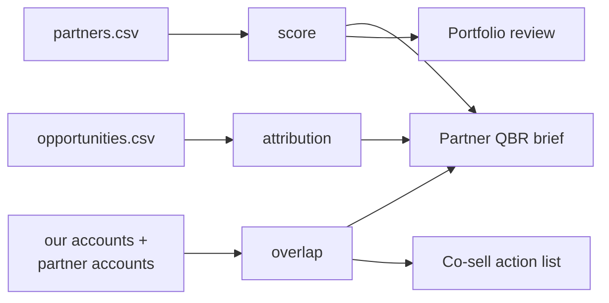

# AI Ecosystem Partnerships

[](https://github.com/varunk130/ai-ecosystem-partnerships/actions/workflows/ci.yml)
[](LICENSE)
[](pyproject.toml)

A small, tested toolkit for running a partner ecosystem on evidence instead of
anecdote: score partner fit, tier the portfolio, map account overlap, and
attribute pipeline to partners. It ships as a dependency-free Python CLI plus
three skills for Claude Code and GitHub Copilot.

**Created and maintained by [Varun Kulkarni](https://github.com/varunk130)**

> All data in this repository is synthetic.

## Contents

- [How it fits together](#how-it-fits-together)
- [Quickstart](#quickstart)
- [What it answers](#what-it-answers)
- [Skills](#skills)
- [Documentation](#documentation)
- [Related work](#related-work)
- [License](#license)

## How it fits together



## Quickstart

Requires Python 3.10 or newer. There is nothing to install.

```bash
git clone https://github.com/varunk130/ai-ecosystem-partnerships.git
cd ai-ecosystem-partnerships
python -m partner_ecosystem score data/partners.csv
```

```text
partner                type      score  tier       borderline  weakest      motion
---------------------  --------  -----  ---------  ----------  -----------  ----------------------------------------------------
Northwind Data         isv       94.6   Strategic              icp_fit      Joint business plan, exec cadence, dedicated co-sell
Halcyon Cloud          cloud     92.2   Strategic              icp_fit      Joint business plan, exec cadence, dedicated co-sell
Brightline Consulting  si        75.8   Strategic  yes         integration  Joint business plan, exec cadence, dedicated co-sell
Kestrel AI             isv       59.0   Growth                 traction     Targeted account mapping and co-marketing
...
```

## What it answers

| Question | Command |
|----------|---------|
| Which partners deserve investment, and what holds each back? | `python -m partner_ecosystem score data/partners.csv` |
| Which shared accounts should we work with a partner, and how? | `python -m partner_ecosystem overlap data/our_accounts.csv data/partner_accounts.csv` |
| What did partners source and influence, and do attached deals win more? | `python -m partner_ecosystem attribution data/opportunities.csv` |

Add `--json` to any command for machine-readable output.

## Skills

| Skill | Use it for |
|-------|-----------|
| [partner-fit-scorecard](skills/partner-fit-scorecard/SKILL.md) | Portfolio reviews and tiering decisions |
| [co-sell-account-mapping](skills/co-sell-account-mapping/SKILL.md) | Turning account overlap into an owned action list |
| [partner-qbr-brief](skills/partner-qbr-brief/SKILL.md) | A one-page brief for a partner review |

Install one with `cp -r skills/partner-fit-scorecard ~/.claude/skills/`.

## Documentation

- [How to use](docs/HOW-TO-USE.md): commands, input formats, skill installation
- [Scoring methodology](docs/scoring-methodology.md): weights, caps, tiers, and a worked example
- [Contributing](CONTRIBUTING.md): how changes land on the protected `main` branch
- [Changelog](CHANGELOG.md)

## Related work

- [ai-partner-ecosystem-analysis](https://github.com/varunk130/ai-partner-ecosystem-analysis): research any ISV or partner from their public site
- [ai-gtm-skill-library](https://github.com/varunk130/ai-gtm-skill-library): GTM skills, including partner strategy
- [ai-revops](https://github.com/varunk130/ai-revops): multi-agent runtime across GTM, Partnerships, and RevOps

## License

[MIT](LICENSE)
