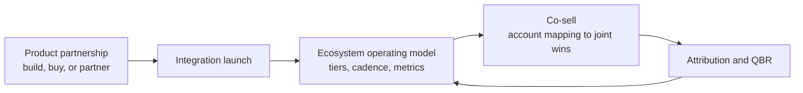

# Partnership Playbooks

How to run partnerships, written as decisions rather than theory. Each playbook pairs with the CLI and skills in this repository.

| Playbook | Read it when | Pairs with |
|----------|--------------|------------|
| [Product partnerships](product-partnerships.md) | Deciding whether to build, buy, or partner, and how deep an integration should go | `product-partnership-evaluator`, `integration-launch-plan` |
| [Leading a partner ecosystem](leading-a-partner-ecosystem.md) | Setting tiers, cadence, metrics, and ownership across a portfolio | `partner-fit-scorecard`, `joint-business-plan`, `partner-qbr-brief` |
| [Co-sell](co-sell.md) | Turning account overlap into joint pipeline with clear rules of engagement | `co-sell-account-mapping`, `partner-eco overlap`, `partner-eco attribution` |

## How they fit together

A product reason to partner comes first. Without one, co-sell is two sales teams comparing lists.
